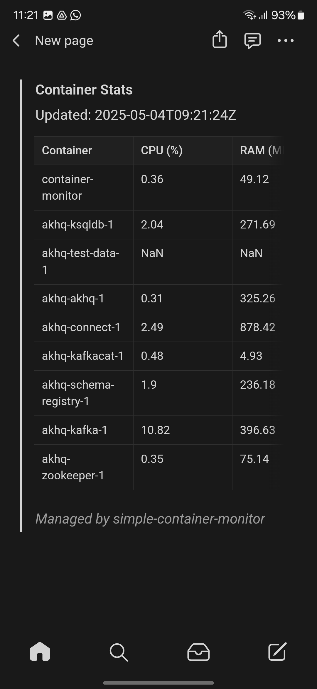

# Simple Container Stats on a Notion Page

An easily-inspectable TypeScript file without dependencies that runs as a Docker container to show CPU and memory usage for all containers in the free Notion mobile app or on the web.
<br/><br/>
Create a free Notion (https://notion.com) account with a page and an integration and pass in the information to this monitor and it will update the container stats on the page every minute.
<br/><br/>
No need to open ports and configure web routes or sign up for expensive monitoring services to get basic container stats in your mobile phone.

## Setup
1. Create a Notion integration:
- Go to https://www.notion.so/my-integrations
- Click "New integration" and create an internal integration
- Name your integration (e.g., "Container Monitor")
- Select the workspace where you want to use the integration
- Set the capabilities needed (Read content, Update content, Insert content)
- Click "Submit" to create the integration
- Copy the "Internal Integration Token" - this is your NOTION_TOKEN

2. Create a Notion page for the stats and associate it with your integration:
- Click "..." in the top right of the page
- Go to the Connections submenu and select your integration
- Copy the page ID from the URL (the part after the workspace name and before the question mark)
   Example: https://www.notion.so/workspace/83c75a51b3b8476b97c0a5141f72b9e9
   The ID is: 83c75a51b3b8476b97c0a5141f72b9e9

3. Deploy the monitor in a container 
- From NPM
   ```
   docker run -d --name container-monitor \
   -v /var/run/docker.sock:/var/run/docker.sock \
   -e NOTION_TOKEN=secret_abcdefghijklmnopqrstuvwxyz1234567890 \
   -e NOTION_PAGE_ID=page_id \
   node:18-alpine \
   npx simple-container-monitor
   ```
- With Docker Compose, add the following service definition to your `docker-compose.yml` file:
   ```yaml
   services:
     container-monitor:
       image: node:18-alpine
       container_name: container-monitor
       volumes:
         - /var/run/docker.sock:/var/run/docker.sock
       environment:
         NOTION_TOKEN: secret_abcdefghijklmnopqrstuvwxyz1234567890
         NOTION_PAGE_ID: page_id
       command: npx simple-container-monitor
       restart: unless-stopped
   ```
- Or if you want to run the code directly from this repo to inspect the file before running  
   Clone this repo or download the SimpleContainerMonitor.ts file, then run the following Docker command.
   ```
   docker run -d --name container-monitor \
   -v /var/run/docker.sock:/var/run/docker.sock \
   -v /absolute_path/to/SimpleContainerMonitor.ts:/app/SimpleContainerMonitor.ts \
   -e NOTION_TOKEN=secret_abcdefghijklmnopqrstuvwxyz1234567890 \
   -e NOTION_PAGE_ID=page_id \
   -w /app \
   node:18-alpine \
   npx tsx SimpleContainerMonitor.ts
   ```

Also runnable as a service outside Docker if Node 18+ is installed by setting the NOTION_TOKEN and NOTION_PAGE_ID environment variables end exectuing
   ```npx simple-container-monitor```

### Environment Variables

- `NOTION_TOKEN` (required): The integration token from step 1
- `NOTION_PAGE_ID` (required): ID of an existing page to update


## Prerequisites

- Node.js 18 or higher
- Notion account

## FAQ
### Why are the stats shown inside a quote block?
The Notion API does not support batched updates and deletes so the wrapper allows deleting and writing the new block with 2 requests.

### Why not Google Sheets/Airtable etc.
Other services have complicated setup flows or limited free tiers. For instance, Google Sheets requires creating an OAuth app and authorizing the access using a visual UI.

## License

This project is licensed under the [MIT License](./LICENSE).
